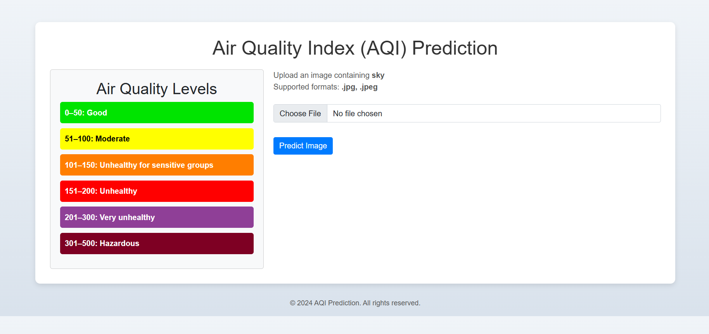
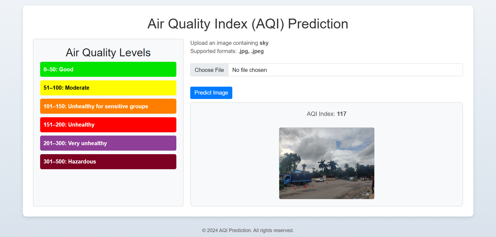

# <div align='center'>🌍 AQI Prediction 🌤️</div>

This is the application of our undergrad thesis. The thesis is about predicting the **Air Quality Index (AQI)** of a city using **Machine Learning**. We have used the data of the city of Dhaka, Bangladesh (open-source) to train our model. The model we have used here is our proposed custom model **(DeepAQNet)** which outperforms the other pre-trained models and the models worked on the same dataset. Just by capturing the image of the surrounding environment, the user can get the **real-time AQI** of that place.

---

## 📋 Table of Contents
- [🌍 AQI Prediction 🌤️](#-aqi-prediction-️)
  - [📋 Table of Contents](#-table-of-contents)
  - [📖 Introduction](#-introduction)
    - [🌬️ What is AQI?](#️-what-is-aqi)
    - [🤔 Why is AQI important?](#-why-is-aqi-important)
    - [🇧🇩 Why is AQI prediction important for Bangladesh?](#-why-is-aqi-prediction-important-for-bangladesh)
  - [🚀 Result of our Proposed Model](#-result-of-our-proposed-model)
  - [🛠️ How to use the application?](#️-how-to-use-the-application)
  - [📸 Web Screenshots](#-web-screenshots)

---

## 📖 Introduction
### 🌬️ What is AQI?
The **Air Quality Index (AQI)** indicates air pollution levels and their potential health effects. It measures pollutants such as particulate matter, ozone, carbon monoxide, sulfur dioxide, and nitrogen dioxide.

### 🤔 Why is AQI important?
The AQI communicates daily air quality and guides precautions for public health. Categories:

- **0-50**:    🟢 Good
- **51-100**:  🟡 Moderate
- **101-150**: 🟠 Unhealthy for Sensitive Groups
- **151-200**: 🔴 Unhealthy
- **201-300**: 🟣 Very Unhealthy
- **301-500**: ⚫ Hazardous

### 🇧🇩 Why is AQI prediction important for Bangladesh?
Bangladesh faces severe air pollution due to urbanization, industrialization, and vehicular emissions. Dhaka often ranks among the world's most polluted cities. Real-time AQI predictions can help people take precautions against harmful air quality.

---


## 🚀 Result of our Proposed Model
We have trained our proposed model **(DeepAQNet)** on the dataset of Dhaka, Bangladesh. The model has achieved the following performance metrics on the test dataset:

| 🧪 Metric | ⚙️ Value |
| --- | ---- |
| **MSE** | 1685.03 |
| **RMSE** | 41.05 |
| **MAE** | 30.55 |
| **R2 Score** | 0.4229 |

---

## 🛠️ How to use the application?
**Note:** 🐍 Python must be installed on your system.

1. Clone the repository. 🌀
   ```bash
   git clone https://github.com/fahadPathan7/AQI-Prediction-Web.git
   ```
2. Change the directory. 📂
   ```bash
   cd AQI-Prediction-Web
   ```
3. Install the required libraries. 📦
   ```bash
   pip install flask tensorflow numpy pillow matplotlib lime scikit-image
   ```
4. Run the application. 🚀
   ```bash
   python app.py
   ```
5. Open the browser and go to the following URL. 🌐
   ```bash
   http://localhost:5000/
   ```
6. Capture the image of the surrounding environment. 📸
7. Click on the **Predict** button to get the real-time AQI of that place. ✅
8. Get the AQI and take necessary precautions to protect yourself from the harmful effects of air pollution. 🌬️

---

## 📸 Web Screenshots
<div align='center'>
    <b>🖼️ Before Uploading the Image</b> <br>
     <br>
</div>

<p align='center' style="font-size: 25px; text-align: center;">⬇️</p>

<div align='center'>
    <b>📷 After Uploading & Predicting the Image</b> <br>
     <br>
</div>

---